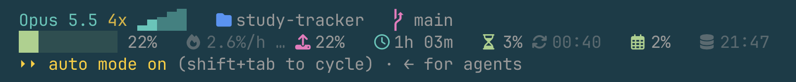

# claude-statusline

A two-line status line for [Claude Code](https://code.claude.com), written for people on a
Pro or Max subscription: it shows how fast a session uses the 5-hour budget, not a dollar
amount.



## What it shows

Line 1, left to right:

| Part | Meaning |
|---|---|
| `Opus 5.5` | The model. |
| `4x` | Model weight: the model's list price per token against Haiku 4.5, the cheapest model. Haiku 4.5 is 1x, Sonnet 5.5 2x, Opus 5.5 4x, Opus 5 5x, Fable 5.1 10x. Fast mode doubles it. |
| Five rising blocks | Effort. The blocks up to the current level (low, medium, high, xhigh, max) are lit, the rest are faded. A bolt follows when fast mode is on. |
| Folder | The current folder. |
| Branch | The git branch, then `+n` staged files (green) and `~n` modified files (yellow). |
| Pull request | Number and review state of the branch's open pull request, colored by state. |

Line 2, left to right:

| Part | Meaning |
|---|---|
| Bar and percent | How full the context window is. Green, yellow from 70%, red from 90%. |
| Fire, `12%/h` | Burn rate: this session's last 10 minutes, as percent of the 5-hour budget per hour. Yellow from 10, red from 20 (20%/h empties a full budget within the window). |
| Speech bubble, `0.9%` | What the current turn (everything since your last prompt) took from the 5-hour budget. |
| Tray with arrow out, `22%` | Output share: the part of the turn's cost spent on thinking and writing. This is the most that a lower effort could save. The rest is input, which shrinks with `/compact` or `/clear`. |
| Clock | Session time. |
| Hourglass | Percent of the 5-hour limit used, and the time it resets. |
| Calendar | Percent of the 7-day limit used. |
| Database | The time the prompt cache goes cold. Once cold, a snowflake and the number of tokens the next message has to store again. |

Every part after the folder is left out when Claude Code does not send its data.

## Install

```sh
curl -fsSL https://raw.githubusercontent.com/laszloprekop/claude-statusline/main/install.sh | bash
```

This downloads `statusline.sh` to `~/.claude/` and sets `statusLine` in
`~/.claude/settings.json`. The previous settings are kept as `settings.json.bak-statusline`.

By hand: save `statusline.sh` anywhere and add this to `~/.claude/settings.json`:

```json
"statusLine": {
  "type": "command",
  "command": "bash ~/.claude/statusline.sh"
}
```

To remove it, delete the `statusLine` entry, the script and `~/.claude/statusline-state/`.

## Requirements

- `bash` (3.2 or later), `jq`, `git`, `awk`.
- A [Nerd Font](https://www.nerdfonts.com) for the icons. Ghostty has the icons built in.
  Without one, the icons show as empty boxes and the text still reads correctly.
- macOS. The script is written to run on Linux too, but that has not been tested.
- The limit figures (hourglass, calendar, burn rate) need a claude.ai Pro or Max
  subscription. Claude Code does not send limit data to pay-per-use accounts.

## How the burn rate works

Claude Code reports the 5-hour limit as a whole percent for the whole account. That is too
coarse for one turn and it mixes all sessions. So the script calibrates:

1. Every session's status line records how much that session has spent, using Claude Code's
   list-price cost estimate as a hidden unit.
2. When the account's percentage rises, the script divides what all sessions on the machine
   spent by the points gained. The result is "cost per 1%".
3. Each session's own spending is converted to percent with that value.

What you see while it learns:

- `2.6%/h …` (faded): nothing learned yet. This is the whole account's average over the
  current window. It lasts until the 5-hour percentage has risen by 2 points.
- `~12%/h`: a rough value, measured over fewer than 5 points.
- `12%/h`: measured over 5 points or more. The value is kept between windows.

State lives in `~/.claude/statusline-state/`. Session files idle for two days are removed.

## Limits

- The calibration is an estimate, not Anthropic's accounting. It assumes the limit counts
  tokens in about the same proportions as the price list.
- Usage the script cannot see (Claude on another machine, claude.ai, the phone app) raises
  the percentage without any recorded spending, which makes local sessions look more
  expensive than they are.
- The model weight is a price ratio, not a published limit ratio. The table in the script
  was read from the [pricing page](https://platform.claude.com/docs/en/about-claude/pricing)
  on 2026-10-06 and has to be updated by hand.
- Effort has no multiplier: it does not change the price of a token, only how many tokens
  the model writes. The output share is the measured effect.
- Subagents are not part of the output share.
- The status line only runs when the conversation updates, so the cache time can stay on
  screen after it has passed.

## Tests

```sh
tests/run.sh
```

Runs the script against invented input and compares the text.

## License

MIT
